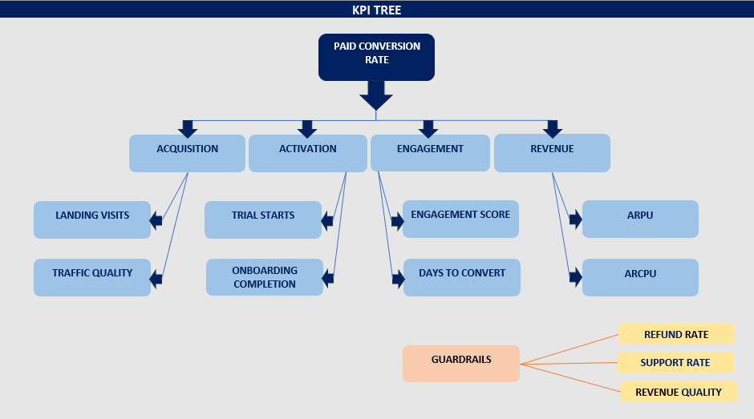
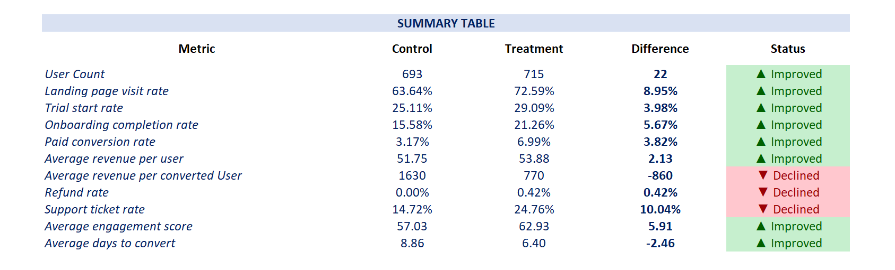
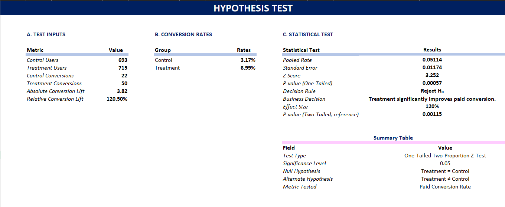

# Part 2: KPI Framework, Business Experiment Analysis & Decision Recommendation

---

## Executive Overview

This project evaluates the effectiveness of a newly introduced onboarding and activation campaign for a subscription-based digital product company.

The business objective is to determine whether the Treatment onboarding experience should replace the existing Control experience based on measurable improvements in user conversion, engagement, and revenue performance while ensuring customer experience and operational stability are not negatively impacted.

---

# Business Context

The company launched a controlled A/B experiment to evaluate a redesigned onboarding and activation experience.

Users were randomly assigned into two groups:

| Group | Description |
|---------|-------------|
| Control | Existing onboarding experience |
| Treatment | New onboarding and activation campaign |

Leadership requires a data-driven recommendation on whether the Treatment experience should be rolled out to all users.

---

# Business Problem Statement

## 1. The Core Business Decision

- The company must determine whether the new onboarding and activation campaign (Treatment) should replace the existing onboarding experience (Control) for all new users. 
- This decision cannot be based solely on conversion uplift; it must consider customer quality, user experience, operational impact, and long-term revenue implications. Similar to how companies like Netflix or Spotify evaluate onboarding changes, success must be measured holistically rather than through a single metric.

---

## 2. Stakeholders Impacted by the Decision

The rollout decision directly impacts multiple business functions:

- Product teams responsible for user onboarding and activation.
- Marketing teams responsible for acquisition efficiency and campaign ROI.
- Customer Success teams handling support requests and user complaints.
- Revenue leadership responsible for subscription growth and monetization.
- Finance teams monitoring customer lifetime value and revenue quality.
- End users who experience the onboarding journey.

A successful rollout can accelerate subscription growth, while a poor rollout may increase support costs, refunds, and customer dissatisfaction.

---

## Primary Business Objective

The primary objective of the experiment is to increase the percentage of users who convert from free users into paying subscribers.

The core business objective is:

> Increase paid customer acquisition while maintaining customer quality and operational efficiency.

Based on the experiment results:

> Control Conversion Rate = 3.17% 
> Treatment Conversion Rate = 6.99%

This represents approximately a **120%** increase in paid conversion rate, indicating that the new onboarding experience has the potential to accelerate subscription growth if implemented correctly.

---

## 3. North Star Metric That Must Improve

### Paid Conversion Rate

**Formula**

```text
Paid Conversion Rate = Converted Users / Total Users
```

### Why This Metric Matters

- Paid Conversion Rate directly measures the company's ability to transform acquired users into paying subscribers.

- Unlike engagement or onboarding metrics, this KPI has a direct relationship with recurring subscription revenue and long-term business growth.

---

## Supporting Metrics Required for Context

Although Paid Conversion Rate is the North Star Metric, supporting metrics are necessary to understand why conversion changes occur and whether the improvement is sustainable.

The following supporting metrics provide context behind conversion performance:

- Landing Page Visit Rate
- Trial Start Rate
- Onboarding Completion Rate
- Average Engagement Score
- Average Days to Convert
- Average Revenue Per User (ARPU)
- Average Revenue Per Converted User (ARPCU)

These metrics help explain movement within the conversion funnel and identify areas of improvement or concern.

---

## 4. Business Risks That Must Be Monitored

A conversion increase alone does not guarantee business success.

The experiment data reveals several risks that require monitoring:

- Support Ticket Rate increased from **14.72%** to **24.76%**.
- Refund Rate increased from **0.00%** to **0.42%**.
- Revenue Per Converted User decreased from **₹1630.10** to **₹770.41**.
- Certain traffic segments performed worse under Treatment.

These findings suggest the onboarding campaign may be attracting lower-value customers or creating user confusion despite generating more conversions.

## Customer Quality and Revenue Quality Risk

One of the most critical findings from the experiment is the substantial decline in revenue generated per converted customer.

### Experiment Results

| Metric | Control | Treatment |
|----------|----------:|----------:|
| Revenue Per Converted User (ARPCU) | ₹1,630.10 | ₹770.41 |

### Key Insight

This represents a decline of approximately **52.7%** in revenue generated per converted customer.

### Business Impact

From a business perspective, a higher conversion rate does not automatically translate into higher profitability. While the Treatment experience successfully increased the number of users converting to paid subscriptions, the average revenue generated by each converted customer decreased significantly.

This raises concerns that the Treatment may be attracting lower-value customers, encouraging lower-priced plan selections, or converting users with weaker long-term monetization potential.

As a result, leadership must evaluate not only the volume of conversions generated by the campaign but also the overall quality, profitability, and long-term value of those conversions before making a full rollout decision.

---

## Operational and Customer Experience Risk

Another critical risk identified during the experiment is the substantial increase in customer support demand.

### Experiment Results

| Metric | Control | Treatment |
|----------|----------:|----------:|
| Support Ticket Rate | 14.72% | 24.76% |

### Key Insight

This represents an increase of approximately **68%** in support ticket volume.

### Business Impact

A significant rise in support ticket activity may indicate that users are experiencing confusion, friction, technical issues, or unmet expectations during the onboarding journey.

If the Treatment experience is launched to the entire user base without understanding the underlying causes of this increase, the company may experience:

- Higher customer support costs
- Increased workload for Customer Success teams
- Longer support response times
- Lower customer satisfaction scores
- Increased churn and retention risk
- Reduced operational efficiency

For these reasons, support ticket trends should be treated as a critical guardrail metric and closely monitored during any future rollout.

---

## Segment-Level Risk Assessment

The experiment demonstrates that the Treatment experience does not perform consistently across all user segments.

### Traffic Source Performance

| Traffic Source | Control Conversion Rate | Treatment Conversion Rate |
|---------------|------------------------:|--------------------------:|
| Social | 7.69% | 6.02% |

### Key Insight

Unlike most traffic sources, the Social segment experienced a decline in conversion performance under the Treatment experience.

### Business Impact

This finding suggests that user behavior and onboarding preferences may differ significantly by acquisition channel.

A blanket rollout strategy could therefore reduce performance among certain customer groups, even if overall conversion metrics improve at an aggregate level.

Before implementing a company-wide rollout, leadership should:

- Conduct additional analysis on Social Traffic users
- Investigate onboarding behavior differences by acquisition channel
- Validate results with follow-up experimentation
- Consider a phased or segment-specific rollout strategy

The experiment demonstrates strong overall conversion improvement; however, segment-level performance variability introduces meaningful business risk. A targeted rollout approach is likely to generate better business outcomes than an immediate global deployment.

---

## 5.Evidence Required Before Making a Recommendation

The final recommendation must be supported by quantitative and statistical evidence rather than intuition.

Required evidence includes:

- Demonstrated improvement in Paid Conversion Rate.
- Statistical significance testing of conversion uplift.
- Evaluation of guardrail metrics.
- Revenue quality assessment.
- Segment-level performance analysis.
- Operational risk evaluation.
- Customer experience impact analysis.

The hypothesis test produced a p-value of **0.000573**, indicating that the observed conversion improvement is statistically significant and highly unlikely to be due to random chance.

## Recommendation Criteria

A full launch should only occur if:

- Conversion improvement is statistically significant.
- Revenue quality remains acceptable.
- Support burden remains manageable.
- No critical customer segments experience deterioration.
- Long-term business value improves alongside short-term conversion gains.

Because the Treatment increases conversions but also introduces customer quality and operational risks, the decision should balance growth objectives with business sustainability.

---

# North Star Metric

## Selected North Star Metric: Paid Conversion Rate

### Definition

Paid Conversion Rate measures the percentage of total users who successfully convert into paying subscribers after experiencing the onboarding journey.

### Formula

```text
Paid Conversion Rate = Converted Users / Total Users
```

### Experiment Results

| Metric | Control | Treatment |
|----------|----------:|----------:|
| Paid Conversion Rate | 3.17% | 6.99% |

The Treatment onboarding experience increased Paid Conversion Rate from **3.17% to 6.99%**, representing an improvement of approximately **120%** over the Control experience.

This metric has been selected as the North Star Metric because it directly measures whether the onboarding campaign achieved its primary business objective: converting more users into paying customers.

---

## Why Paid Conversion Rate Is The Main Success Metric

Paid Conversion Rate is the most important metric for this experiment because it directly reflects the business outcome that leadership is trying to achieve.

### Key Reasons

### 1. It Directly Measures Business Success

The purpose of the onboarding campaign is not merely to increase activity within the product. The ultimate objective is to convert users into paying subscribers.

A user visiting a landing page or completing onboarding has no direct business value unless that user eventually becomes a customer.

---

### 2. It Has The Strongest Relationship With Revenue Growth

Subscription businesses generate revenue when users become paying customers.

An increase in Paid Conversion Rate directly increases the number of customers entering the revenue-generating portion of the business.

More paying customers create opportunities for:

- Subscription revenue growth
- Upselling
- Cross-selling
- Customer retention
- Long-term customer lifetime value

---

### 3. It Represents The End Of The Conversion Funnel

Metrics such as landing page visits, trial starts, and onboarding completions are intermediate steps.

Paid Conversion Rate measures whether users successfully complete the entire journey.

This makes it a more meaningful indicator of business performance than upstream funnel metrics.

---

### 4. Leadership Decisions Depend On This Metric

The primary question being asked by leadership is:

> Should the new onboarding experience be launched to all users?

That decision depends primarily on whether the new experience generates more paying customers.

Paid Conversion Rate directly answers this question.

---

### 5. It Captures The Combined Effect Of Multiple Funnel Improvements

Improved landing page performance alone is insufficient.

Improved onboarding completion alone is insufficient.

Paid Conversion Rate captures the cumulative impact of all improvements across the user journey.

---

### 6. It Aligns Product And Business Objectives

Product teams focus on user experience.

Marketing teams focus on acquisition.

Revenue teams focus on monetization.

Paid Conversion Rate acts as a shared metric that aligns all departments around the same business outcome.

---

### 7. The Dataset Demonstrates Significant Improvement

The experiment results show:

| Group | Conversion Rate |
|---------|----------:|
| Control | 3.17% |
| Treatment | 6.99% |

This represents a statistically significant improvement and demonstrates that the Treatment experience successfully influenced the most important business outcome.

---

### 8. It Is Easily Measurable And Actionable

Paid Conversion Rate can be measured consistently across experiments, cohorts, regions, traffic sources, and devices.

This makes it an ideal metric for ongoing optimization and business decision-making.

---

## Why Other Metrics Are Supporting Metrics Instead Of The North Star

Although several metrics improved during the experiment, they are supporting indicators rather than the primary measure of success.

### 1. Landing Page Visit Rate Measures Exposure, Not Business Value

A user visiting a landing page does not create revenue.

The metric only indicates that users reached the beginning of the funnel.

Without conversion, these visits have limited business value.

---

### 2. Trial Start Rate Measures Interest, Not Commitment

Starting a trial demonstrates intent but does not guarantee payment.

Many users start trials and never convert into paying subscribers.

Therefore, Trial Start Rate should support conversion analysis rather than replace it.

---

### 3. Onboarding Completion Rate Measures Process Success

Completing onboarding indicates that users successfully moved through the activation flow.

However, onboarding completion alone does not generate revenue.

A user can complete onboarding and still never purchase a subscription.

---

### 4. Engagement Score Measures Activity, Not Monetization

The dataset shows engagement improved under Treatment.

However, engagement is a leading indicator rather than a direct business outcome.

Highly engaged users are valuable only if that engagement eventually contributes to revenue generation.

---

### 5. Average Days To Convert Measures Speed

Speed is important because faster conversions improve cash flow and reduce acquisition payback periods.

However, speed alone does not determine business success.

Fast conversion of low-value customers may still be undesirable.

---

### 6. Revenue Per User Can Be Influenced By External Factors

Revenue metrics may fluctuate due to pricing changes, promotions, discounting strategies, or customer mix.

These factors can distort performance evaluation if used as the primary metric.

---

### 7. Support Ticket Rate Is A Risk Indicator

Support ticket volume measures operational impact.

It is useful for identifying customer experience issues but does not measure experiment success directly.

---

### 8. Refund Rate Measures Customer Satisfaction

Refund activity helps evaluate customer quality and satisfaction.

However, it should function as a guardrail rather than the primary success metric.

---

## How Paid Conversion Rate Connects To Business Growth

Paid Conversion Rate is one of the most important growth drivers for subscription-based businesses.

### 1. More Conversions Create More Revenue Opportunities

Every additional paying customer increases recurring revenue potential.

Higher conversion rates improve monetization efficiency across the business.

---

### 2. Acquisition Spend Becomes More Efficient

If conversion rates increase, the company generates more customers from the same marketing budget.

This improves Return on Advertising Spend (ROAS) and Customer Acquisition Cost (CAC) efficiency.

---

### 3. Growth Scales Without Increasing Traffic

Improving conversion allows the business to generate more revenue from existing traffic.

This is often more cost-effective than acquiring additional users.

---

### 4. Higher Conversion Improves Unit Economics

Strong conversion performance improves revenue generation relative to acquisition costs.

This strengthens business profitability.

---

### 5. Better Conversion Accelerates Revenue Forecasts

Subscription businesses rely heavily on conversion assumptions for forecasting.

Improved conversion rates increase forecast reliability and growth potential.

---

### 6. Increased Customer Base Creates Expansion Opportunities

More paying customers create opportunities for:

- Upgrades
- Premium plans
- Add-on purchases
- Annual subscriptions

---

### 7. Investor And Executive Teams Monitor Conversion Closely

Conversion metrics are commonly reviewed by leadership because they provide a direct indicator of growth efficiency.

Strong conversion performance often signals a healthy product-market fit.

---

### 8. Real-World Example

Companies such as
Netflix,
Spotify,
Duolingo,
Canva,
and
Slack

continuously optimize onboarding flows because even small improvements in conversion rates can generate millions of dollars in additional annual revenue when applied across large user bases.

---

## What Could Go Wrong If Paid Conversion Rate Is Optimized Blindly

Although Paid Conversion Rate is the North Star Metric, focusing exclusively on it can create significant business risks.

### 1. Low-Quality Customers May Be Acquired

The experiment shows that Revenue Per Converted User declined significantly under Treatment.

This suggests that more customers are converting, but they may be lower-value customers.

---

### 2. Revenue Quality May Deteriorate

The dataset shows:

| Metric | Control | Treatment |
|----------|----------:|----------:|
| Revenue Per Converted User | ₹1,630.10 | ₹770.41 |

A business can increase conversion while simultaneously reducing profitability.

---

### 3. Customer Support Costs May Increase

The experiment also shows:

| Metric | Control | Treatment |
|----------|----------:|----------:|
| Support Ticket Rate | 14.72% | 24.76% |

A higher conversion rate accompanied by higher support costs may reduce overall business value.

---

### 4. Customer Satisfaction May Decline

Aggressive onboarding tactics can encourage users to convert before they fully understand the product.

This may create frustration and dissatisfaction later.

---

### 5. Refund Requests May Increase

Users who convert prematurely are more likely to request refunds or cancel subscriptions.

This creates operational and financial inefficiencies.

---

### 6. Segment-Level Performance May Be Hidden

The dataset shows that Social Traffic users performed worse under Treatment.

An overall conversion increase can hide poor performance within specific customer segments.

---

### 7. Long-Term Retention May Suffer

A conversion-focused strategy may increase short-term purchases while reducing long-term retention and customer lifetime value.

---

### 8. Decision-Makers May Ignore Important Guardrails

A balanced business decision requires monitoring:

- Refund Rate
- Support Ticket Rate
- Revenue Quality
- Customer Satisfaction
- Segment Performance

Optimizing Paid Conversion Rate without monitoring these guardrail metrics can lead to misleading conclusions and poor long-term business outcomes.

---

# Dataset Description

The dataset contains user-level experiment data collected during the onboarding campaign.

The data includes:

- Experiment Group Assignment
- User Activity Tracking
- Trial Participation
- Onboarding Completion
- Paid Conversion Status
- Revenue Generated
- Refund Requests
- Support Tickets
- Engagement Scores
- Conversion Timing
- User Segmentation Attributes

The dataset was analyzed to evaluate conversion performance and business impact across Control and Treatment groups.

---

# Data Quality Assessment

The dataset was reviewed before analysis.

## Validation Checks Performed

### Missing Values

Checked all fields for null and missing observations.

### Duplicate User IDs

Identified duplicate user records and documented findings.

### Group Distribution

Validated Control and Treatment population sizes.

### Binary Field Validation

Verified that all binary indicators contained only valid values:

```text
0 = No
1 = Yes
```

### Revenue Outlier Assessment

Performed IQR-based outlier analysis on revenue values.

### Segment Distribution Review

Validated distribution consistency across:

- Region
- Device Type
- Traffic Source
- Plan Type

---

# KPI Framework

## North Star Metric

### Paid Conversion Rate

The North Star Metric represents the primary measure of experiment success.

---

## KPI Tree Structure

### Driver 1: Traffic Quality

- Landing Page Visit Rate
- Traffic Source Performance

### Driver 2: User Activation

- Trial Start Rate
- Onboarding Completion Rate

### Driver 3: User Engagement

- Engagement Score
- Days to Convert

### Guardrail Metrics

- Refund Rate
- Support Ticket Rate
- Revenue Per Converted User

---

# Experiment Analysis Approach

The experiment was evaluated using descriptive analysis and statistical hypothesis testing.

Analysis included:

1. Control vs Treatment comparison
2. Funnel conversion analysis
3. Revenue performance analysis
4. Segment-level performance analysis
5. Guardrail metric evaluation
6. Statistical significance testing

---

# Hypothesis Testing

## Null Hypothesis (H₀)

The Treatment onboarding experience does not improve Paid Conversion Rate compared to the Control experience.

```text
Treatment Conversion Rate ≤ Control Conversion Rate
```

---

## Alternative Hypothesis (H₁)

The Treatment onboarding experience improves Paid Conversion Rate compared to the Control experience.

```text
Treatment Conversion Rate > Control Conversion Rate
```

---

## Test Configuration

| Item | Value |
|--------|--------|
| Test Type | One-Tailed Two-Proportion Z-Test |
| Significance Level | 0.05 |
| Metric Tested | Paid Conversion Rate |

---

## Statistical Result

| Metric | Result |
|----------|----------|
| Test Statistic (Z) | 3.252 |
| P-Value | 0.000573 |

### Decision

Since:

```text
P-Value < 0.05
```

The Null Hypothesis is rejected.

The Treatment experience delivers a statistically significant improvement in Paid Conversion Rate.

---

# Key Findings

## Conversion Performance

| Metric | Control | Treatment |
|----------|----------|----------|
| Paid Conversion Rate | 3.17% | 6.99% |

### Result

The Treatment experience generated approximately:

```text
+120% Conversion Improvement
```

---

## User Engagement

| Metric | Control | Treatment |
|----------|----------|----------|
| Engagement Score | 57.03 | 62.93 |

User engagement improved significantly under Treatment.

---

## Conversion Speed

| Metric | Control | Treatment |
|----------|----------|----------|
| Days to Convert | 8.86 | 6.40 |

Users converted faster under Treatment.

---

# Guardrail Metrics

## Refund Rate

| Control | Treatment |
|----------|----------|
| 0.00% | 0.42% |

Minor increase observed.

---

## Support Ticket Rate

| Control | Treatment |
|----------|----------|
| 14.72% | 24.76% |

Significant increase observed.

---

## Revenue Per Converted User

| Control | Treatment |
|----------|----------|
| ₹1630.10 | ₹770.41 |

Revenue quality declined significantly.

---

# Segment Analysis

## Strongest Performing Segments

### Region

- North
- South
- East

### Device

- Mobile
- Tablet

### Traffic Source

- Referral
- Email
- Organic
- Paid Search

---

## Underperforming Segment

### Social Traffic

The Treatment experience underperformed the Control experience for users acquired through Social channels.

Additional testing is recommended before rollout to this segment.

---

# Final Recommendation

> **Recommended Decision: Launch for Selected Segments**

The Treatment experience produced a statistically significant improvement in Paid Conversion Rate and improved engagement metrics.

However, increased support ticket volume and reduced revenue quality create measurable business risks.

A phased rollout focused on high-performing segments is recommended while additional investigation is conducted into:

- Support ticket drivers
- Customer quality deterioration
- Revenue quality decline
- Social traffic performance

---

# Assumptions & Limitations

- Results are based on the observed experiment period.
- Long-term retention data was unavailable.
- Customer Lifetime Value (LTV) was not included.
- Revenue quality should be monitored post-launch.
- Additional validation is required for Social traffic users.

---

# Screenshots

## KPI Tree



---

## Summary Metrics



---

## Hypothesis Test Output



---